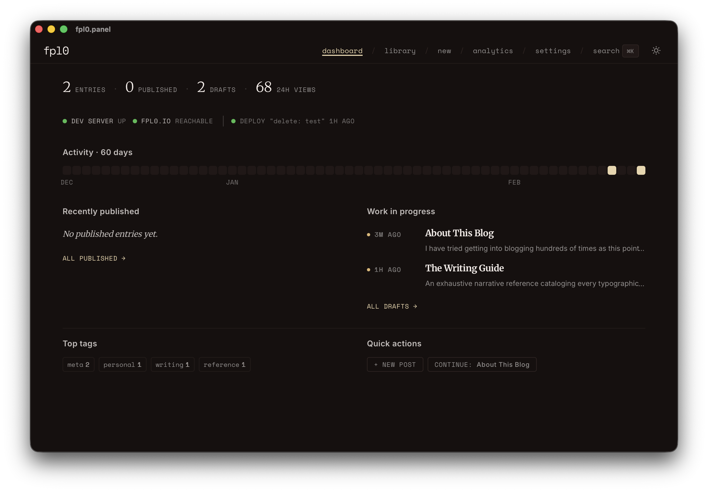

# fpl0.panel

A management panel for editing and publishing content to [fpl0.io](https://fpl0.io).

## Features

- **MDX Editor**: A custom TipTap editor built for writing and managing blog posts with technical components (code blocks, diagrams, and media).
- **Metadata Management**: Quick access to edit titles, summaries, dates, and tags.
- **Publishing Workflow**: One-click publishing to move drafts into the live blog repository.
- **Design Parity**: Shared typography and design tokens with the main blog for a consistent writing experience.

## Getting Started

1. **Install dependencies**: `npm install` or `bun install`
2. **Run in development**: `npm run tauri dev`
3. **Build executable**: `npm run tauri build`

## Shortcuts

- `Cmd + S`: Save to disk
- `Cmd + Shift + P`: Publish to blog
- `/`: Open the slash command menu in the editor
